# Projeto Fluxo de Caixa

## 1. Entendimento do Negócio
O `Fluxo de Caixa` é uma das principais ferramentas de gestão financeira, pois permite acompanhar de forma clara todas as entradas e saídas de recursos de uma organização em determinado período. Ele possibilita analisar a liquidez da empresa, identificar tendências de receita e despesa, além de apoiar a tomada de decisão estratégica. Por meio do monitoramento do fluxo de caixa, é possível prever cenários futuros, planejar investimentos, controlar custos e garantir a sustentabilidade financeira do negócio.

### 1.1. Como os dados são gerados
Os dados do fluxo de caixa são gerados a partir dos registros financeiros diários da empresa, como recebimentos de clientes, pagamentos a fornecedores, despesas operacionais, impostos e movimentações bancárias. Essas informações são normalmente registradas nos sistemas contábeis, ERPs ou planilhas de controle financeiro.

### 1.2. Quais as fontes de dados
As principais fontes de dados incluem sistemas de gestão financeira (ERP), relatórios contábeis, extratos bancários, planilhas de controle de receitas e despesas, além de projeções de entradas e saídas futuras fornecidas pelos departamentos financeiro e administrativo.

### 1.3. Quem usa os dados e de que forma extrai
Os dados do fluxo de caixa são utilizados principalmente por gestores financeiros, controladores e analistas de dados. Eles extraem e analisam essas informações por meio de ferramentas de BI, como o Power BI, para acompanhar o desempenho financeiro, identificar gargalos de liquidez, avaliar prazos de pagamento/recebimento e apoiar decisões estratégicas de curto e longo prazo.

### 1.4. Qual o racional de cálculo
O cálculo do fluxo de caixa é baseado na diferença entre entradas e saídas de recursos em determinado período. <br>
A fórmula básica é: <br>
`Fluxo de Caixa = Entradas - Saídas` <br>
A partir dessa estrutura, podem ser analisados o fluxo operacional, o fluxo de investimentos e o fluxo de financiamentos, permitindo uma visão completa da movimentação financeira e da capacidade de geração de caixa da empresa.

## 2. Justificativas do Projeto

### 2.1. Necessidade de Desenvolvimento da Solução

`Porque deste desenvolvimento:` <br>
O desenvolvimento da solução de Fluxo de Caixa é necessário para consolidar e automatizar o controle financeiro da organização, permitindo uma visão integrada e em tempo real das entradas e saídas de recursos. <br>

`O que será feito:` <br>
A solução proposta visa centralizar dados de diferentes fontes (ERP, planilhas e extratos bancários), padronizar cálculos de fluxo de caixa e disponibilizar indicadores e visualizações interativas no Power BI. Dessa forma, será possível aprimorar o monitoramento financeiro, apoiar decisões estratégicas e antecipar cenários de receita, despesa e saldo de caixa. <br>

### 2.2. Tecnologias/Ferramentas Utilizadas
- `Git & GitHub`: Controle de versionamento durante o desenvolvimento do projeto, em ambiente local ou em nuvem.
- `Visual Studio Code`: Ambiente de desenvolvimento integrado. Software para execução do projeto (IDE: Integrated Development Environment).
- `Power BI`: Visualização dos dados e geração de insights para o negócio.

## 3. Desenvolvimento

### 3.1. Arquitetura do Projeto
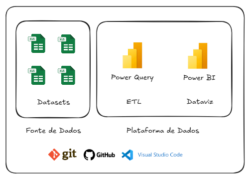

### 3.2. Datasets
Este projeto é composto de `04 Datasets`:
- Bancos.xlsx;
- PlanoContas.xlsx;
- Movimentos.xlsx;
- SaldoAnterior.xlsx.

### 3.3. Dicionário de Dados
É o documento que descreve de forma padronizada todas as informações utilizadas neste projeto, detalhando as colunas do dataset, os tipos de dados e as descrições para cada coluna. Ele serve como referência para garantir consistência, transparência e entendimento comum entre as equipes de negócio, TI e análise de dados, facilitando a manutenção e a integração das bases de dados.

#### 3.3.1. Dataset: "Bancos.xlsx":
 <br>

#### 3.3.2. Dataset: "PlanoContas.xlsx":
 <br>

#### 3.3.3. Dataset: "Movimentos.xlsx":
 <br>

#### 3.3.4. Dataset: "SaldoAnterior.xlsx":
 <br>

### 3.4. Ingestão de Dados no Power BI
Foi adicionado no Power BI as 4 tabelas mostradas na seção anterior. <br>
Foi renomeado o nome das tabelas para adequar ao `Modelo Dimensional`. <br>
_(Obs.: Informação da dim__calendario será detalhada no tópico seguinte)._ <br>


### 3.5. Transformação de Dados no Power Query

#### 3.5.1. Tabelas dim_bancos & dim_contas
Não foi preciso realizar transformações nas tabelas. 

#### 3.5.2. Tabela f_movimentos
- 1ª, como melhor prática para performance, foram inseridas as colunas `Conta_ID (Tabela dim_contas)` e `Banco_ID (Tabela dim_bancos)`. Abaixo seguem os passos realizados: <br>

`Mesclar consulta:`

<br>

`Escolher: coluna:` Como exemplo, imagem da escolha pela coluna `Banco_ID`.


- 2ª, as colunas inseridas foram renomeadas para `Conta_ID` e `Banco_ID`.

- 3ª, "excluir" as colunas `Conta` e `Banco` e "ordenar" as colunas conforme ordem preferida. Abaixo segue o passo realizado: <br>


- 4ª, na coluna `Tipo`, com valores "Entrada" e "Saída", a ação foi por mostrar apenas o 1ª caractere, "E" e "S". Finalidade de deixar os dados da coluna "clean". Abaixo segue o passo realizado: <br>


- 5ª, na coluna `Valor`, o tipo de dado foi alterado para "Número decimal fixo". <br>
-- Alguns motivos: Evita erros de arredondamento. Mais confiável para cálculos de dinheiro, taxas, juros, impostos. Em relatórios financeiros e de fluxo de caixa, precisão absoluta é obrigatória (mesmo centavos importam). Este tipo garante que as somas e agregações não tenham distorções de arredondamento. <br>
-- Boa prática: Sempre que a coluna representa moeda, saldo bancário, receitas ou despesas, escolha `Número Decimal` Fixo no Power Query. <br>
Abaixo segue o passo realizado: <br>


- 6ª, segue abaixo tabela final com todas as transformações realizadas:


#### 3.5.3. Tabela f_saldo_anterior
- Na coluna `Valor`, o tipo de dado foi alterado para "Número decimal fixo". Mesmo motivo explicado na tabela `f_movimentos, coluna "Valor"`. <br>


- Segue abaixo tabela final com as transformações realizadas: <br>


#### 3.5.4. Criação da tabela `dim_calendario`.
Segue abaixo modelo criado da tabela dim_calendario. Obs.: Menor data da base de dados foi 02/Jan/23. <br>
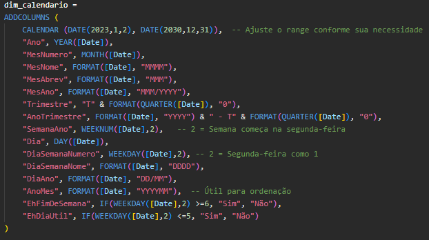

#### 3.5.5. Ajustes na tabela `dim_calendario`
- Clicar no canto superior direito da tabela (...), Clicar em `Marcar como tabela de data`. <br>
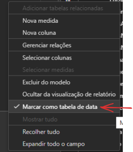

- Nas colunas de datas de todas as tabelas, configurar em "Propriedades" o formato desejado. A opção foi pelo formato de data mais curto. <br>  
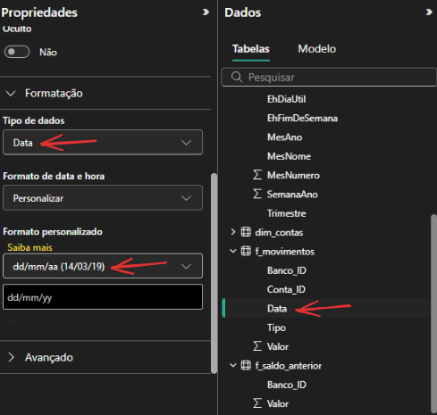

- Nas colunas de `MesNome` e `MesAbrev`, classificar pelo `MesNumero`.
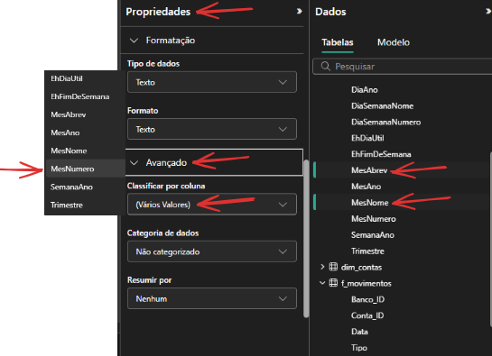

- Outros ajustes, tabela `dim_contas`: <br>
-- Coluna Conta, classificar por coluna Conta_ID. <br>
-- Coluna Subgrupo, classificar por coluna Subgrupo_ID.

### 3.6. Modelagem Dimensional
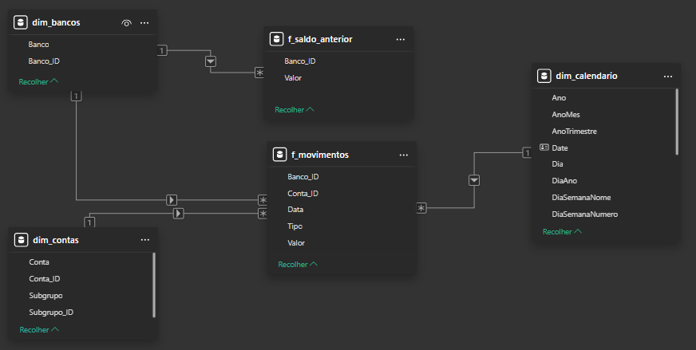

### 3.7. Desenvolvimento dos Dashboards (Dataviz)

#### 3.7.1. Medidas
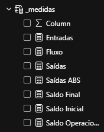

##### `Sobre: Entradas`
```
Entradas = 
    CALCULATE(
        SUM(f_movimentos[Valor]),
        f_movimentos[Tipo] = "E"   
    )
```

A medida Entradas calcula o total de valores financeiros classificados como entradas de recursos no fluxo de caixa. <br>

Por meio da função CALCULATE, é somado o campo Valor da tabela f_movimentos, aplicando um filtro que considera apenas os registros onde o campo Tipo é igual a "E" (Entradas). <br>

Em resumo, essa medida retorna o somatório de todos os recebimentos da empresa — como receitas, vendas ou outros ingressos de caixa — servindo de base para o cálculo do saldo operacional e demais indicadores financeiros no dashboard.

##### `Sobre: Saídas`
```
Saídas = 
    CALCULATE(
        SUM(f_movimentos[Valor]),
        f_movimentos[Tipo] = "S"   
    )
```

A medida Saídas calcula o total de valores referentes às saídas de recursos no fluxo de caixa. <br>

Utilizando a função CALCULATE, ela soma o campo Valor da tabela f_movimentos, aplicando um filtro que considera apenas os registros em que o campo Tipo é igual a "S" (Saídas). <br>

Em resumo, essa medida representa todos os pagamentos e despesas realizados pela empresa — como fornecedores, folha de pagamento, impostos e outros desembolsos — sendo essencial para a apuração do saldo operacional e do saldo final no dashboard de fluxo de caixa.

##### `Sobre: Saídas ABS`
```
Saídas ABS = ABS([Saídas])
```

A medida Saídas ABS tem como objetivo retornar o valor absoluto das saídas financeiras. <br>

Ela utiliza a função ABS, que converte números negativos em positivos, aplicada sobre a medida [Saídas]. Dessa forma, independentemente do sinal do valor original, o resultado sempre será positivo. <br>

Em resumo, essa medida é usada para padronizar a exibição dos valores de saída, facilitando a leitura e comparação nos gráficos e indicadores do dashboard de fluxo de caixa.

##### `Sobre: Saldo Operacional`
```
Saldo Operacional = sum(f_movimentos[Valor])
```

A medida Saldo Operacional calcula o resultado líquido das movimentações financeiras em determinado período. <br>

Por meio da função SUM, ela soma todos os valores do campo Valor da tabela f_movimentos, considerando tanto entradas (valores positivos) quanto saídas (valores negativos). <br>

Em resumo, essa medida mostra o resultado operacional do caixa, indicando se a empresa apresentou superávit (saldo positivo) ou déficit (saldo negativo) após considerar todas as movimentações do período analisado.

##### `Sobre: Saldo Inicial`
```
Saldo Inicial = 
    CALCULATE(
        SUM(f_movimentos[Valor]),
        dim_calendario[Date] < MIN(dim_calendario[Date])
    ) + SUM(f_saldo_anterior[Valor])

```

A medida Saldo Inicial calcula o valor de caixa acumulado antes do período selecionado na análise. <br>

Ela utiliza a função CALCULATE para somar os valores da tabela f_movimentos cujas datas em dim_calendario[Date] são anteriores à menor data do contexto atual do filtro (MIN(dim_calendario[Date])). Em seguida, adiciona o valor proveniente da tabela f_saldo_anterior, que representa o saldo trazido de períodos anteriores (mês ou exercício anterior). <br>

Em resumo, essa medida determina o ponto de partida do fluxo de caixa para o período analisado, servindo como base para o cálculo do saldo final e para a correta visualização da evolução financeira ao longo do tempo.

##### `Sobre: Saldo Final`
```
Saldo Final = [Saldo Inicial] + [Saldo Operacional]
```

A medida Saldo Final calcula o total disponível em um determinado período somando o Saldo Inicial com o Saldo Operacional. <br>

- Saldo Inicial: representa o valor que já estava disponível no início do período.
- Saldo Operacional: representa as entradas e saídas ocorridas ao longo do período.

Portanto, o Saldo Final indica o valor total ao final do período considerado, refletindo a posição financeira após todas as movimentações.

##### `Sobre: Fluxo`
```
Fluxo = 
VAR __GrupoID = SELECTEDVALUE(dim_grupos[Grupo_ID])
RETURN
    IF(
        __GrupoID IN {3, 4, 5} && ISINSCOPE(dim_contas[Subgrupo]),
        BLANK(),
        
        SWITCH(
            SELECTEDVALUE(dim_grupos[Grupo_ID]),
            1, [Entradas],
            2, [Saídas],
            3, [Saldo Operacional],
            4, [Saldo Inicial],
            5, [Saldo Final]
        )
    )    
```

A medida Fluxo retorna dinamicamente diferentes valores dependendo do grupo selecionado e do nível de detalhamento na visualização: <br>

Primeiro, captura o Grupo_ID selecionado (__GrupoID). <br>

Se o Grupo_ID for 3, 4 ou 5 e houver detalhamento por subgrupo, retorna BLANK() para evitar duplicação ou inconsistência na visualização. <br>

Caso contrário, utiliza o SWITCH para retornar o valor correspondente ao grupo: <br>

1. → [Entradas]
2. → [Saídas]
3. → [Saldo Operacional]
4. → [Saldo Inicial]
5. → [Saldo Final]

Em resumo, a medida ajusta automaticamente o valor mostrado no relatório conforme o grupo e o nível de detalhe, garantindo que os dados façam sentido visualmente.

#### 3.7.2. Página "Matriz"
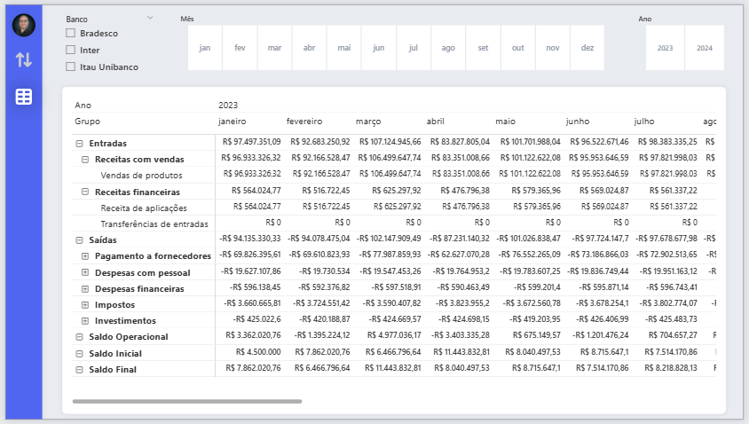

Inserido visuais de `Segmentação de Dados` por `Tipo de Banco, Mês e Ano.`
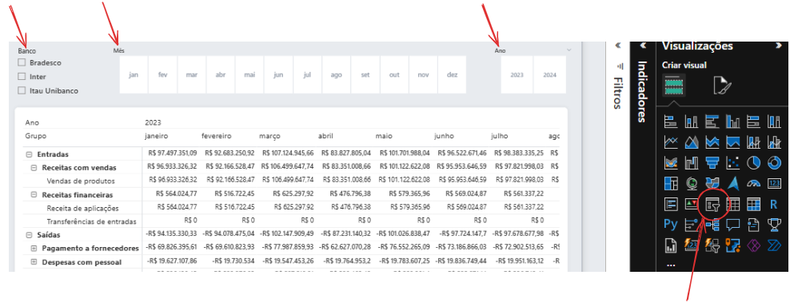

Inserido visual de `Matriz` para análise detalhada por período.
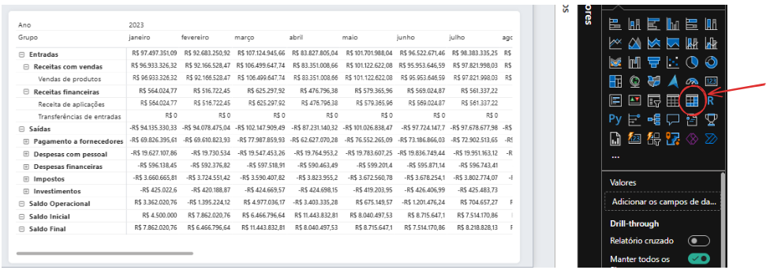

#### 3.7.3. Página "DFC" 
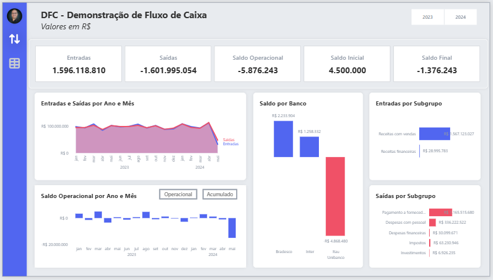

Parte superior da página: Inserido `Segmentação de Dados` por `Ano` e `Cartão (novo)` para os `Números Principais do Negócio (Big Numbers)`.
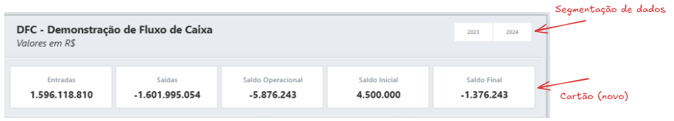

Para os dashboards desta página, seue abaixo tipos de gráficos selecionados:
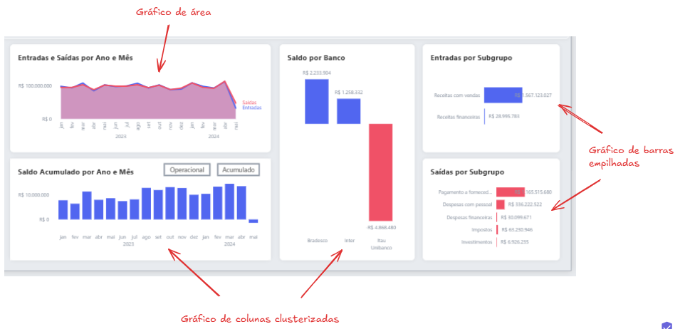

#### 3.7.4. Navegação entre páginas
Apresentado forma de inserir os botões nos ícones, assim como explicação de ação para cada botão.
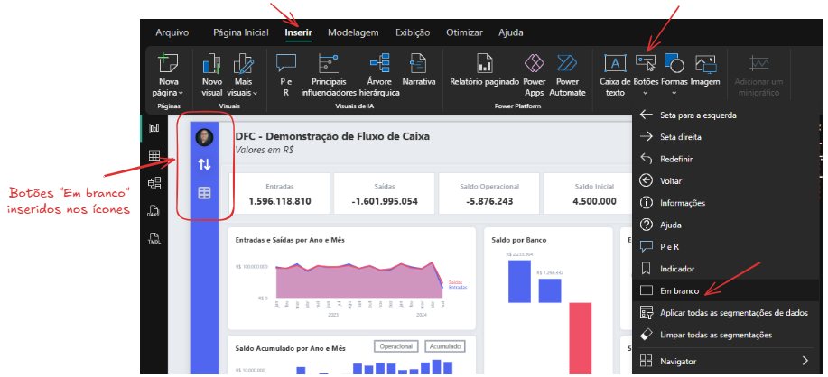


## 4. Conclusão/Resultados para o Negócio
O desenvolvimento da solução de Fluxo de Caixa no Power BI permitiu centralizar e automatizar o tratamento dos dados financeiros, integrando informações provenientes de diferentes fontes (sistemas contábeis, bancos e planilhas operacionais). <br>

A estrutura do modelo de dados foi projetada para suportar análises dinâmicas por ano, mês, banco e categoria de receita ou despesa, possibilitando a visualização consolidada na Página DFC (indicadores e gráficos de desempenho) e a análise detalhada na Página Matriz (tabelas dinâmicas com valores por período). <br>

Como resultado, a solução proporciona: <br>

- Maior precisão e rastreabilidade dos dados financeiros;
- Redução do tempo de consolidação e atualização de informações;
- Padronização dos cálculos de saldo operacional, inicial e final;
- Apoio à tomada de decisão baseada em dados atualizados e confiáveis. <br>

Com isso, o projeto contribui diretamente para o aprimoramento do controle de liquidez, planejamento financeiro e gestão estratégica dos recursos da organização.