# Projeto Fluxo de Caixa

## 1. Entendimento do Negócio
O `Fluxo de Caixa` é uma das principais ferramentas de gestão financeira, pois permite acompanhar de forma clara todas as entradas e saídas de recursos de uma organização em determinado período. Ele possibilita analisar a liquidez da empresa, identificar tendências de receita e despesa, além de apoiar a tomada de decisão estratégica. Por meio do monitoramento do fluxo de caixa, é possível prever cenários futuros, planejar investimentos, controlar custos e garantir a sustentabilidade financeira do negócio.

## 2. Justificativas do Projeto

### 2.1. Necessidade de Desenvolvimento da Solução (What | Why)

### 2.2. Tecnologias/Ferramentas Utilizadas
- `Git & GitHub`: Controle de versionamento durante o desenvolvimento do projeto, assim como conectar os dados em nuvem.
- `Visual Studio Code`: Ambiente de desenvolvimento integrado. Software para execução do projeto (IDE: Integrated Development Environment).
- `Power BI`: Visualização dos dados e geração de insights para o negócio.

## 3. Desenvolvimento

### 3.1. Datasets
Este projeto é composto de `04 Datasets`:
- Bancos.xlsx;
- PlanoContas.xlsx;
- Movimentos.xlsx;
- SaldoAnterior.xlsx.

### 3.2. Dicionário de Dados

#### 3.2.1. Dataset: "Bancos.xlsx":
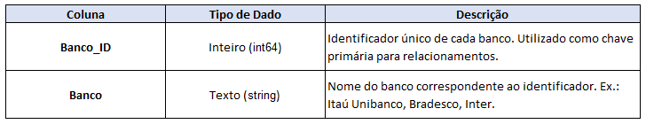  

#### 3.2.2. Dataset: "PlanoContas.xlsx":
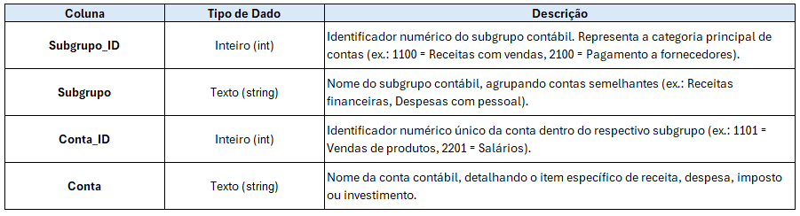  

#### 3.2.3. Dataset: "Movimentos.xlsx":
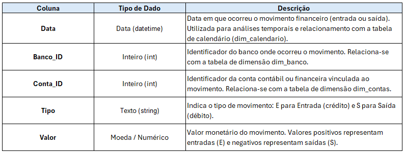  

#### 3.2.4. Dataset: "SaldoAnterior.xlsx":
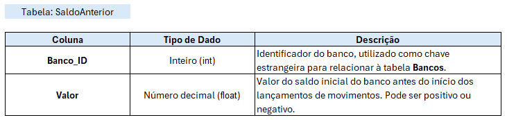  

### 3.3. Ingestão de Dados no Power BI
Foi adicionado no Power BI as 4 tabelas mostradas na seção anterior.  
Foi renomeado o nome das tabelas para adequar ao `Modelo Dimensional`.  
_(Obs.: Informação da dim__calendario será detalhada no tópico seguinte)._  

### 3.4. Transformação de Dados no Power Query

#### 3.4.1. Tabelas dim_bancos & dim_contas
Não foi preciso realizar transformações nas tabelas. 

#### 3.4.2. Tabela f_movimentos
- 1ª, como melhor prática para performance, foram inseridas as colunas `Conta_ID (Tabela dim_contas)` e `Banco_ID (Tabela dim_bancos)`. Abaixo seguem os passos realizados:  

`Mesclar consulta:`
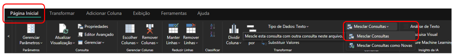
 

`Escolher: coluna:` Como exemplo, imagem da escolha pela coluna `Banco_ID`.
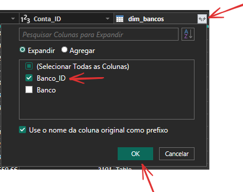

- 2ª, as colunas inseridas foram renomeadas para `Conta_ID` e `Banco_ID`.

- 3ª, "excluir" as colunas `Conta` e `Banco` e "ordenar" as colunas conforme ordem preferida. Abaixo segue o passo realizado:  
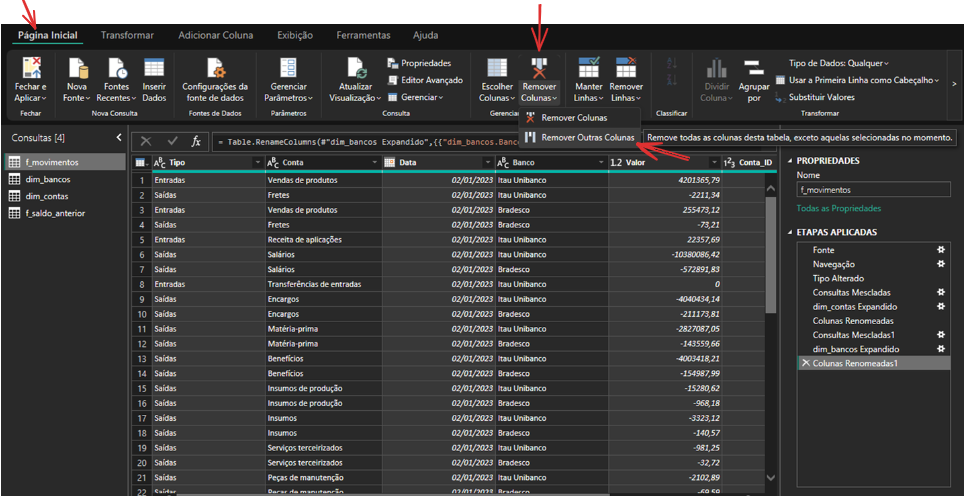

- 4ª, na coluna `Tipo`, com valores "Entrada" e "Saída", a ação foi por mostrar apenas o 1ª caractere, "E" e "S". Finalidade de deixar os dados da coluna "clean". Abaixo segue o passo realizado:  
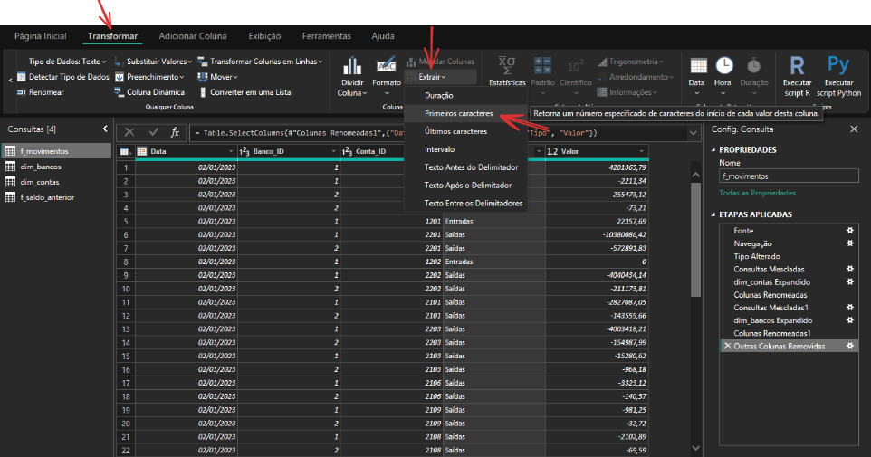
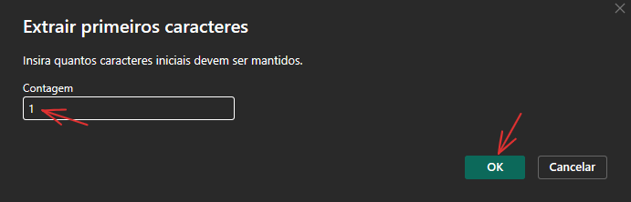

- 5ª, na coluna `Valor`, o tipo de dado foi alterado para "Número decimal fixo".  
-- Alguns motivos: Evita erros de arredondamento. Mais confiável para cálculos de dinheiro, taxas, juros, impostos. Em relatórios financeiros e de fluxo de caixa, precisão absoluta é obrigatória (mesmo centavos importam). Este tipo garante que as somas e agregações não tenham distorções de arredondamento.  
-- Boa prática: Sempre que a coluna representa moeda, saldo bancário, receitas ou despesas, escolha `Número Decimal` Fixo no Power Query.  
Abaixo segue o passo realizado:  
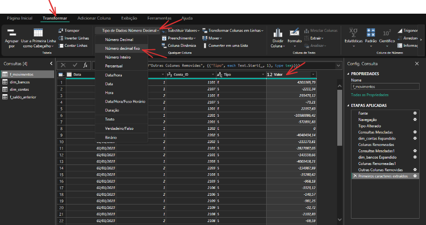

- 6ª, segue abaixo tabela final com todas as transformações realizadas:
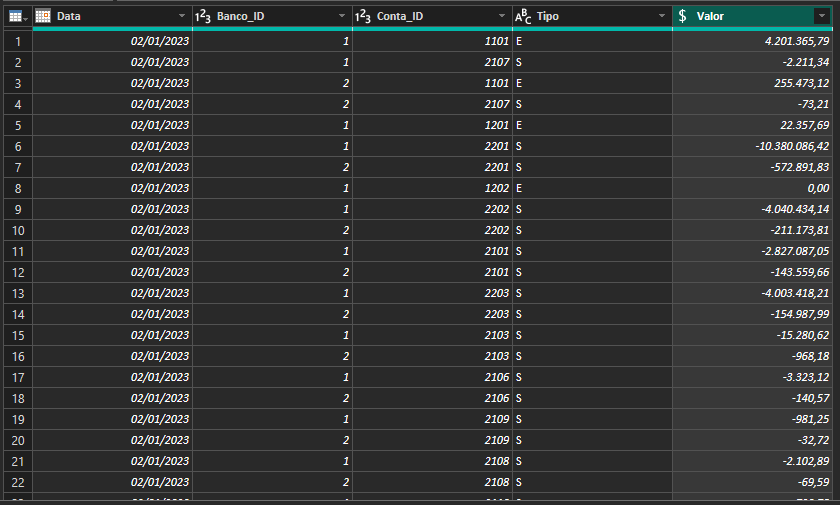

#### 3.4.3. Tabela f_saldo_anterior
- Na coluna `Valor`, o tipo de dado foi alterado para "Número decimal fixo". Mesmo motivo explicado na tabela `f_movimentos, coluna "Valor"`.  
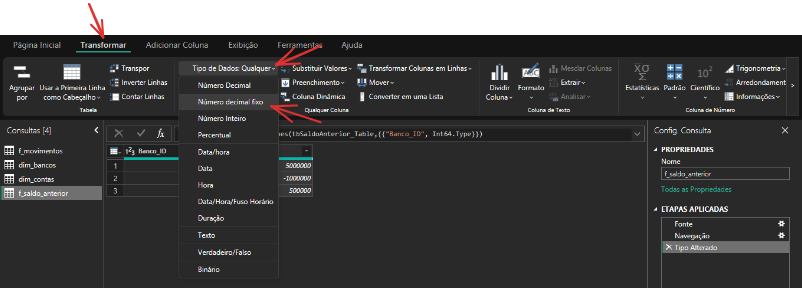

- Segue abaixo tabela final com as transformações realizadas:  
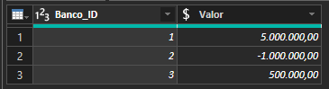

## 4. Conclusão/Resultados para o Negócio