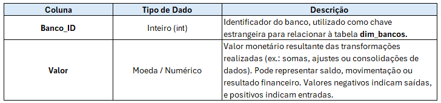

# Projeto Fluxo de Caixa

## 1. Entendimento do Negócio
O `Fluxo de Caixa` é uma das principais ferramentas de gestão financeira, pois permite acompanhar de forma clara todas as entradas e saídas de recursos de uma organização em determinado período. Ele possibilita analisar a liquidez da empresa, identificar tendências de receita e despesa, além de apoiar a tomada de decisão estratégica. Por meio do monitoramento do fluxo de caixa, é possível prever cenários futuros, planejar investimentos, controlar custos e garantir a sustentabilidade financeira do negócio.

## 2. Justificativas do Projeto

### 2.1. Necessidade de Desenvolvimento da Solução (What | Why)

### 2.2. Tecnologias/Ferramentas Utilizadas
- `Git & GitHub`: Controle de versionamento durante o desenvolvimento do projeto, assim como conectar os dados em nuvem.
- `Visual Studio Code`: Ambiente de desenvolvimento integrado. Software para execução do projeto (IDE: Integrated Development Environment).
- `Power BI`: Visualização dos dados e geração de insights para o negócio.

## 3. Desenvolvimento

### 3.1. Datasets
Este projeto é composto de `04 Datasets`:
- Bancos.xlsx;
- PlanoContas.xlsx;
- Movimentos.xlsx;
- SaldoAnterior.xlsx.

### 3.2. Dicionário de Dados

#### 3.2.1. Dataset: "Bancos.xlsx":
  

#### 3.2.2. Dataset: "PlanoContas.xlsx":
  

#### 3.2.3. Dataset: "Movimentos.xlsx":
  

#### 3.2.4. Dataset: "SaldoAnterior.xlsx":
  

## 4. Conclusão/Resultados para o Negócio