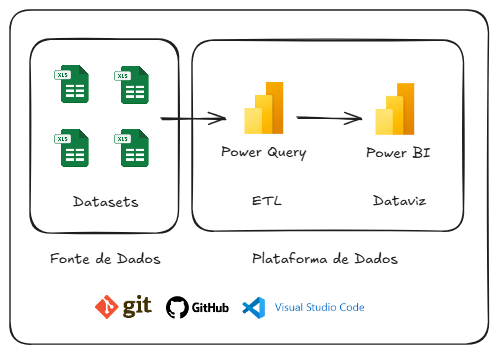

# Projeto Fluxo de Caixa

## 1. Entendimento do Negócio
O `Fluxo de Caixa` é uma das principais ferramentas de gestão financeira, pois permite acompanhar de forma clara todas as entradas e saídas de recursos de uma organização em determinado período. Ele possibilita analisar a liquidez da empresa, identificar tendências de receita e despesa, além de apoiar a tomada de decisão estratégica. Por meio do monitoramento do fluxo de caixa, é possível prever cenários futuros, planejar investimentos, controlar custos e garantir a sustentabilidade financeira do negócio.

### 1.1. Como os dados são gerados
Os dados do fluxo de caixa são gerados a partir dos registros financeiros diários da empresa, como recebimentos de clientes, pagamentos a fornecedores, despesas operacionais, impostos e movimentações bancárias. Essas informações são normalmente registradas nos sistemas contábeis, ERPs ou planilhas de controle financeiro.

### 1.2. Quais as fontes de dados
As principais fontes de dados incluem sistemas de gestão financeira (ERP), relatórios contábeis, extratos bancários, planilhas de controle de receitas e despesas, além de projeções de entradas e saídas futuras fornecidas pelos departamentos financeiro e administrativo.

### 1.3. Quem usa os dados e de que forma extrai
Os dados do fluxo de caixa são utilizados principalmente por gestores financeiros, controladores e analistas de dados. Eles extraem e analisam essas informações por meio de ferramentas de BI, como o Power BI, para acompanhar o desempenho financeiro, identificar gargalos de liquidez, avaliar prazos de pagamento/recebimento e apoiar decisões estratégicas de curto e longo prazo.

### 1.4. Qual o racional de cálculo
O cálculo do fluxo de caixa é baseado na diferença entre entradas e saídas de recursos em determinado período.  
A fórmula básica é:  
`Fluxo de Caixa = Entradas - Saídas`  
A partir dessa estrutura, podem ser analisados o fluxo operacional, o fluxo de investimentos e o fluxo de financiamentos, permitindo uma visão completa da movimentação financeira e da capacidade de geração de caixa da empresa.

## 2. Justificativas do Projeto

### 2.1. Necessidade de Desenvolvimento da Solução

`Porque deste desenvolvimento:`  
O desenvolvimento da solução de Fluxo de Caixa é necessário para consolidar e automatizar o controle financeiro da organização, permitindo uma visão integrada e em tempo real das entradas e saídas de recursos.  

`O que será feito:`  
A solução proposta visa centralizar dados de diferentes fontes (ERP, planilhas e extratos bancários), padronizar cálculos de fluxo de caixa e disponibilizar indicadores e visualizações interativas no Power BI. Dessa forma, será possível aprimorar o monitoramento financeiro, apoiar decisões estratégicas e antecipar cenários de receita, despesa e saldo de caixa.  

### 2.2. Tecnologias/Ferramentas Utilizadas
- `Git & GitHub`: Controle de versionamento durante o desenvolvimento do projeto, em ambiente local ou em nuvem.
- `Visual Studio Code`: Ambiente de desenvolvimento integrado. Software para execução do projeto (IDE: Integrated Development Environment).
- `Power BI`: Visualização dos dados e geração de insights para o negócio.

## 3. Desenvolvimento

### 3.1. Arquitetura do Projeto

### 3.2. Datasets
Este projeto é composto de `04 Datasets`:
- Bancos.xlsx;
- PlanoContas.xlsx;
- Movimentos.xlsx;
- SaldoAnterior.xlsx.

### 3.3. Dicionário de Dados

#### 3.3.1. Dataset: "Bancos.xlsx":
  

#### 3.3.2. Dataset: "PlanoContas.xlsx":
  

#### 3.3.3. Dataset: "Movimentos.xlsx":
  

#### 3.3.4. Dataset: "SaldoAnterior.xlsx":
  

### 3.4. Ingestão de Dados no Power BI
Foi adicionado no Power BI as 4 tabelas mostradas na seção anterior.  
Foi renomeado o nome das tabelas para adequar ao `Modelo Dimensional`.  
_(Obs.: Informação da dim__calendario será detalhada no tópico seguinte)._  

### 3.5. Transformação de Dados no Power Query

#### 3.5.1. Tabelas dim_bancos & dim_contas
Não foi preciso realizar transformações nas tabelas. 

#### 3.5.2. Tabela f_movimentos
- 1ª, como melhor prática para performance, foram inseridas as colunas `Conta_ID (Tabela dim_contas)` e `Banco_ID (Tabela dim_bancos)`. Abaixo seguem os passos realizados:  

`Mesclar consulta:`

 

`Escolher: coluna:` Como exemplo, imagem da escolha pela coluna `Banco_ID`.

- 2ª, as colunas inseridas foram renomeadas para `Conta_ID` e `Banco_ID`.

- 3ª, "excluir" as colunas `Conta` e `Banco` e "ordenar" as colunas conforme ordem preferida. Abaixo segue o passo realizado:  

- 4ª, na coluna `Tipo`, com valores "Entrada" e "Saída", a ação foi por mostrar apenas o 1ª caractere, "E" e "S". Finalidade de deixar os dados da coluna "clean". Abaixo segue o passo realizado:  

- 5ª, na coluna `Valor`, o tipo de dado foi alterado para "Número decimal fixo".  
-- Alguns motivos: Evita erros de arredondamento. Mais confiável para cálculos de dinheiro, taxas, juros, impostos. Em relatórios financeiros e de fluxo de caixa, precisão absoluta é obrigatória (mesmo centavos importam). Este tipo garante que as somas e agregações não tenham distorções de arredondamento.  
-- Boa prática: Sempre que a coluna representa moeda, saldo bancário, receitas ou despesas, escolha `Número Decimal` Fixo no Power Query.  
Abaixo segue o passo realizado:  

- 6ª, segue abaixo tabela final com todas as transformações realizadas:

#### 3.5.3. Tabela f_saldo_anterior
- Na coluna `Valor`, o tipo de dado foi alterado para "Número decimal fixo". Mesmo motivo explicado na tabela `f_movimentos, coluna "Valor"`.  

- Segue abaixo tabela final com as transformações realizadas:  

#### 3.5.4. Criação da tabela `dim_calendario`.
Segue abaixo modelo criado da tabela dim_calendario. Obs.: Menor data da base de dados foi 02/Jan/23.  

#### 3.5.5. Ajustes na tabela `dim_calendario`
- Clicar no canto superior direito da tabela (...), Clicar em `Marcar como tabela de data`.  

- Nas colunas de datas de todas as tabelas, configurar em "Propriedades" o formato desejado. A opção foi pelo formato de data mais curto.    

- Nas colunas de `MesNome` e `MesAbrev`, classificar pelo `MesNumero`.

- Outros ajustes, tabela `dim_contas`:  
-- Coluna Conta, classificar por coluna Conta_ID.  
-- Coluna Subgrupo, classificar por coluna Subgrupo_ID.

#### 3.5.6. Modelagem Dimensional

## 4. Conclusão/Resultados para o Negócio